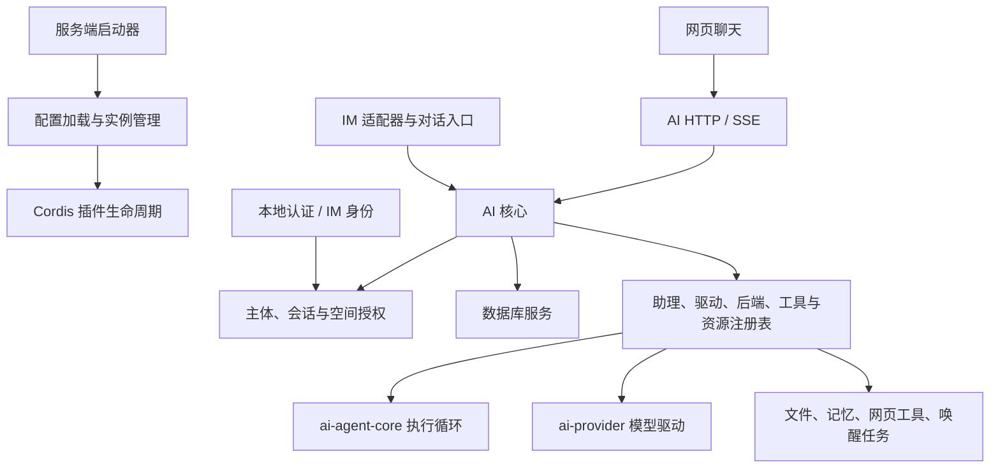

# 架构与边界

Antarestra 采用模块化单进程架构。Cordis 管理依赖图和插件生命周期；服务定义暴露项目接口，具体实现注册后端或能力，入口插件把网页、IM 等请求转换成经过授权的业务调用。共享进程使扩展容易组合，也意味着插件本身必须可信。

## 代码分层

| 位置                      | 实际职责                                                                   |
| ------------------------- | -------------------------------------------------------------------------- |
| `apps/server`             | 选择主配置、提供 Node 模块解析范围、创建 Cordis 上下文、处理退出与监督重启 |
| `packages/config-loader`  | YAML 文档、插件发现、Schema 校验、实例状态和配置管理队列                   |
| `packages/plugin-sdk`     | 统一转导出 Cordis、生命周期注册表、配置校验及加载器/HMR 适配               |
| `packages/contracts`      | 不依赖 pi 或 Vue 的跨边界 DTO，包括对话、运行、内容块与上下文策略          |
| `packages/markdown`       | Markdown 解析、流式分块、HTML 清洗和客户端渲染组件                         |
| `plugins/definitions`     | 共享服务、注册表与契约；AI、RBAC 等也包含业务协调、持久化和 HTTP 接口      |
| `plugins/implementations` | 数据库、对象存储、认证、IM 身份、Agent 循环、日志输出等实现                |
| `plugins/features`        | 提供商与助理管理、聊天、文件、记忆、工具、任务、配置及控制台功能           |
| `plugins/adapters`        | HTTP Server、OneBot 与飞书协议入口                                         |

目录名表示主要职责，不能把 `definitions` 理解为纯 TypeScript 声明。目前 AI 和 RBAC 必须注入 Server，提供商和助理管理还必须注入 WebUI；完全无 HTTP / 无界面的运行组合需要进一步拆分。

图展示业务调用关系；并非完整的包依赖或 Cordis 注入图。

## 一轮对话如何执行

1. 入口通过 RBAC 请求通道解析 Actor 与 Workspace，生成进程内授权句柄，不能用浏览器 JSON 自造身份。
2. AI 核心检查空间、会话修订号和幂等键。会话固定助理 ID，同会话同时只运行一轮，不同会话可以并行。
3. 开始运行时固定助理配置、模型范围、工具注册实例和扩展。后续编辑配置不改写既有快照；绑定实现卸载会取消运行。
4. `ai-agent-core` 通过受控的 `runtime.request()` 和 `runtime.executeTools()` 推进循环；`ai-provider` 负责协议、凭据和模型流。两者不互相导入实现。
5. 核心在每次请求前组装提示词和历史，处理预算、裁剪及压缩，执行工具校验并持久化事件和运行记录。
6. 网页通过持久游标读取运行 SSE，并通过独立的空间状态流更新会话列表；IM 按入口策略发送结果。断开网页订阅不取消服务端运行。

运行中身份撤销的传播仍有缺口：当前核心不会在每次模型请求和工具批次统一重新授权，部分资源工具会自行复核。该缺口及其他安全问题见[评审报告](reviews/2026-10-03.md)，不能将运行快照视为长期授权保证。

## 数据与空间归属

- **主体与空间**：本地认证创建稳定的个人空间映射；`identity-im` 按机器人账号和聊天范围映射群/私聊空间与成员。没有通用的网页登录共享空间切换与成员管理界面。
- **对话与运行**：由 AI 核心在自己的数据库命名空间保存。编辑与重新生成追加分支，旧工具调用记录保留；重新生成可能再次产生外部副作用。
- **文件**：`workspace-file` 保存空间目录、配额和资源引用；`storage` 与 `storage-s3` 提供对象访问。S3 对象键不直接使用用户路径。
- **记忆**：`memory` 按空间存入 PostgreSQL，提供全局记忆和长期文档全文检索；同一空间内共享，不是每个 Actor 的私有记忆。
- **数据库**：定义层公开统一的 Kysely 查询与迁移契约，实现层选择 SQLite、PostgreSQL 或 MySQL 方言。命名空间隔离用于组织可信插件的数据，不是数据库安全沙箱。

多个插件共同写入时使用 `ctx.database.transaction()`，每个插件通过自己的服务访问自己的命名空间。数据库切换不自动迁移已有业务数据。

## 扩展与回收

能力注册应显式传入所有者上下文，并通过 `ctx.effect()` 回收。卸载必须等待连接、监听器、计时器和在途异步任务结束；重复清理不得影响后来注册的新实例。多实例分别管理配置和状态。

AI 工具允许同名覆盖并以注册栈恢复上一有效实现，其他能力通常拒绝同名注册。运行固定它使用的实例；注册表存在不表示选中的后端、连接或资源一定可用。WebUI 同样为路由、插槽和样式提供生命周期归属。

HMR 已实现插件源码热替换，配置面板已实现在线配置与启停。它们不提供运行状态迁移、无缝请求切换、任意代码沙箱或跨进程一致性。

## 信任与部署边界

插件可执行 Node.js 代码、访问本进程配置及网络，Cordis 的依赖声明不限制恶意插件权限。第三方包、配置管理者和客户端扩展应视为受信任代码来源。未知插件需要独立进程或容器等额外隔离，目前仓库没有该能力。

模型连接的 API Key 由提供商插件明文存入数据库，API 响应只返回遮罩；额外 Header 对授权管理员可编辑。配置面板可读取 YAML 中的明文配置，环境变量引用只展示引用文本。数据库、备份、配置与管理权限都需要相应保护。

现阶段按单进程运行：认证提供者重启撤销旧会话，AI 恢复时将未完成运行标为中断，不重放工具。定时任务的租约和幂等机制不能据此推断整个系统支持多副本。公网多租户部署还需要修复已确认的权限和网络访问问题，并增加并发、费用、历史保留及审计策略。

尚未实现的独立 Skill 加载器、MCP、网站嵌入、向量检索与插件发布生态，和已提供的接口预留应分别看待。领域定义见 [CONTEXT.md](../CONTEXT.md)，AI 设计取舍见 [ADR](adr/0001-ai-core.md)。
